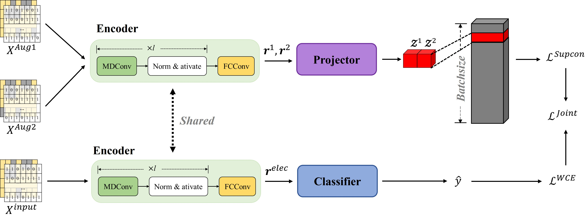
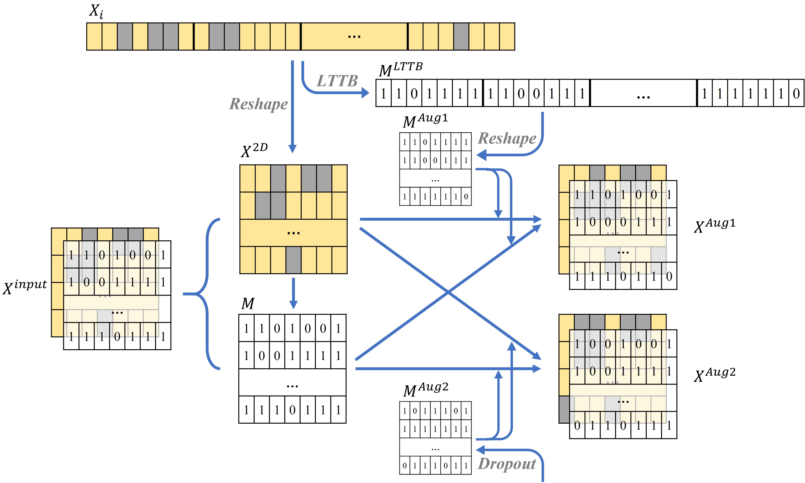

# Contrastive learning for electricity theft detection

*Read this in [English](README_en.md).*

## 概要
这是[A electricity theft detection method through contrastive learning in smart grid](https://jwcn-eurasipjournals.springeropen.com/articles/10.1186/s13638-023-02258-z)的唯一官方开源代码。我们尝试首次将*监督对比学习*应用于窃电检测，并采用 *Largest triangle three bucket(LTTB)* 算法来进行数据增广，获得了不错的效果。下图是我们提出方法的框架图。

## 数据集
我们训练所用的数据集来源于国家电网的真实数据，你可以从[这里](https://github.com/henryRDlab/ElectricityTheftDetection/)下载原始数据。下图是数据预处理的示意图。

## 训练
1. 数据预处理

    首先将下载的电网数据放置在<u>data/SGCC/</u>下，保存为<u>data.csv</u>，数据第一行为列名，第一列为标签，其他列为用电数据，根据<u>data.csv</u>，我们可以得到缺失情况的掩码矩阵数据<u>mask.csv</u>

2. 进行LTTB采样
    运行<u>lttb_for_ETD.py</u>脚本，即可对数据执行500，600，700，800，900，1000的采样，并保存

    ~~~shell
    python lttb_for_ETD.py
    ~~~

3. 模型训练
    模型训练的相关参数保存在<u>model/model_config.yaml</u>。

    模型训练有以下四种训练方式：
    > cpu：CPU模式  
    > gpu：单GPU模型，通过'use_gpu'参数来设置使用的GPU  
    > dp：使用DataParallel(DP)进行训练  
    > ddp：使用DistributedDataParallel(DDP)进行训练
    
    训练方式通过'train_mode'参数进行设置

    执行下面命令即可进行训练

    ~~~shell
    python main.py
    ~~~

## 引用
如果你觉得这个工作有帮助的话，请考虑引用论文

~~~BibTex
@article{liu2023electricity,
  title={A electricity theft detection method through contrastive learning in smart grid},
  author={Liu, Zijian and Ding, Weilong and Chen, Tao and Sun, Maoxiang and Cai, Hongmin and Liu, Chen},
  journal={EURASIP Journal on Wireless Communications and Networking},
  volume={2023},
  number={1},
  pages={1--17},
  year={2023},
  publisher={SpringerOpen}
}
~~~