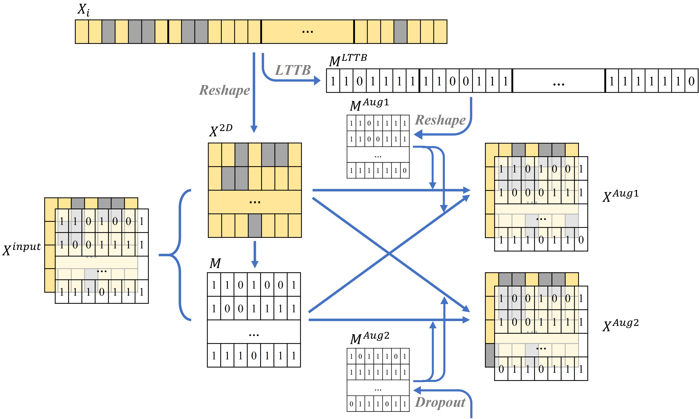

# Contrastive learning for electricity theft detection

## Overview
This is the official open source code for [A electricity theft detection method through contrastive learning in smart grid](https://jwcn-eurasipjournals.springeropen.com/articles/10.1186/s13638-023-02258-z). We tried to apply *supervised contrastive learning* to electricity theft detection for the first time and used the *Largest triangle three bucket (LTTB)* algorithm for data augmentation, achieving good results. The framework of our proposed method is shown below.

## Dataset
The dataset we used for training comes from real data of the State Grid Corporation of China. You can download the original data from [here](https://github.com/henryRDlab/ElectricityTheftDetection/). The diagram below shows the data preprocessing.

## Train
1. Data preprocessing

    First put the downloaded grid data under <u>data/SGCC/</u> and save it as <u>data.csv</u>. The first row of the data is the column name, the first column is the label, and the other columns are electricity usage data. Based on <u>data.csv</u>, we can get the mask matrix data <u>mask.csv</u> for missing values.

2. LTTB sampling
    Run the <u>lttb_for_ETD.py</u> script to sample the data at 500, 600, 700, 800, 900, 1000, and save the results.

    ~~~shell
    python lttb_for_ETD.py
    ~~~

3. Model training
    Model training related parameters are saved in <u>model/model_config.yaml</u>.

     There are four training modes:
    > **cpu**: CPU mode  
    > **gpu**: single GPU model, set GPU to use through 'use_gpu' parameter  
    > **dp**: use DataParallel(DP) for training  
    > **ddp**: use DistributedDataParallel(DDP) for training

    The training mode is set through the 'train_mode' parameter.

    Run the following command for training:

    ~~~shell
    python main.py
    ~~~

## Citation
If you find this work helpful, please consider citing the paper

~~~BibTex
@article{liu2023electricity,
  title={A electricity theft detection method through contrastive learning in smart grid},
  author={Liu, Zijian and Ding, Weilong and Chen, Tao and Sun, Maoxiang and Cai, Hongmin and Liu, Chen},
  journal={EURASIP Journal on Wireless Communications and Networking},
  volume={2023},
  number={1},
  pages={1--17},
  year={2023},
  publisher={SpringerOpen}
}
~~~